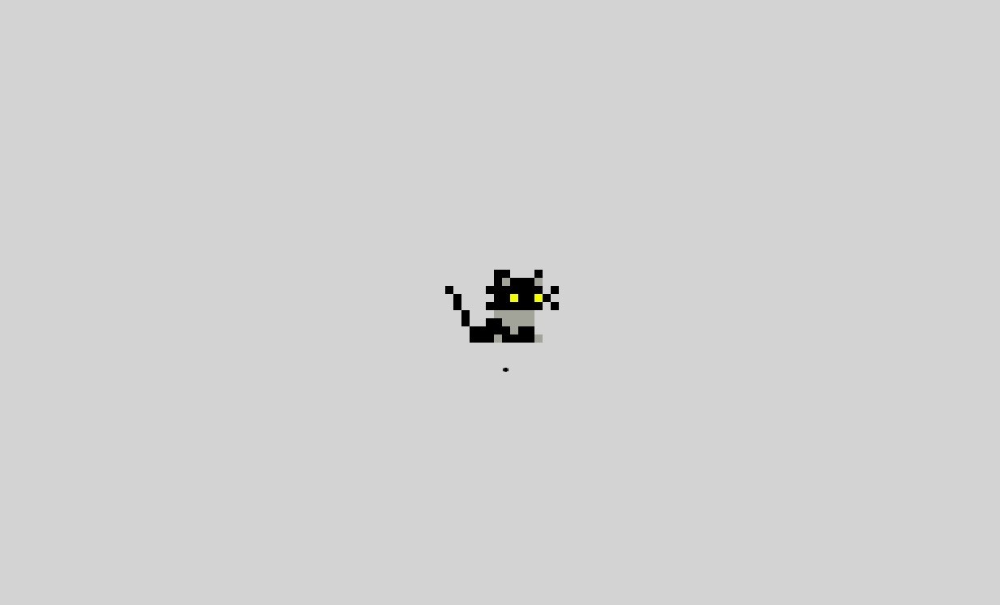
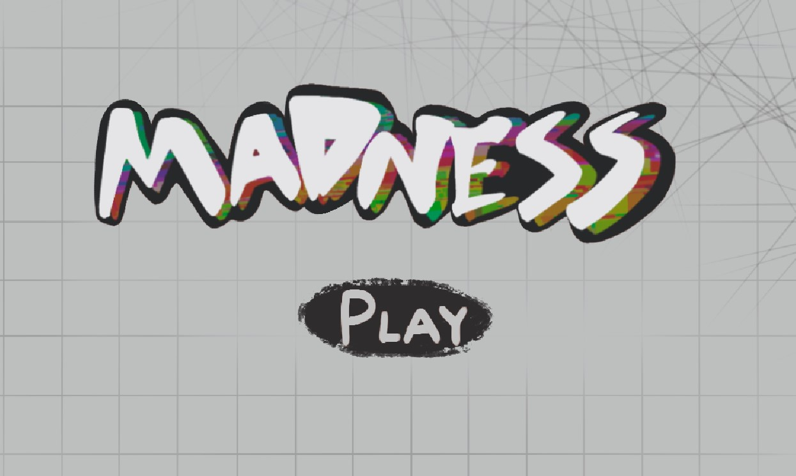
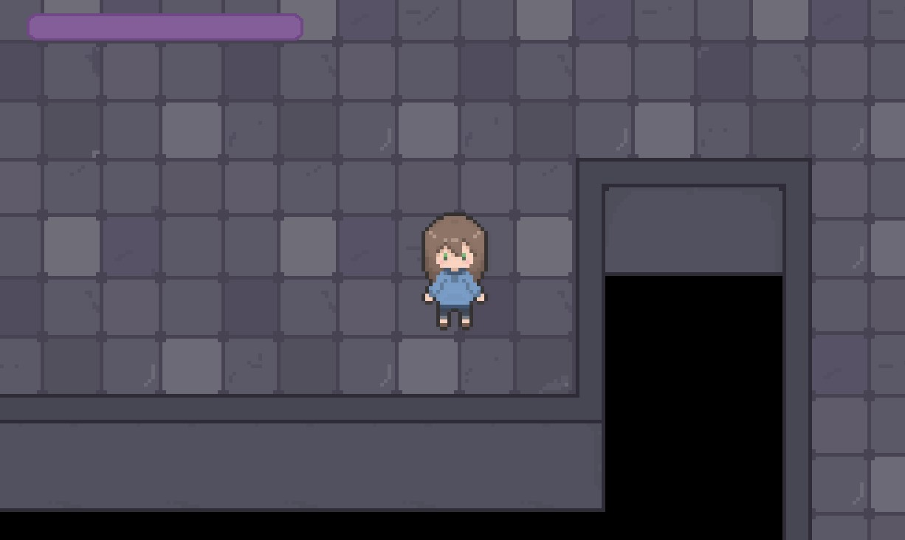

# PVLI-C2024-2025-Grupo7
**Nombre del grupo:** NextStationGames  

***Este proyecto es un trabajo universitario desarrollado como parte de la asignatura PVLI***  

## Redes sociales:
- [Twitter](https://x.com/NextStationG) @NextStationG  

## Descripción:   
**Madness** es un juego RPG en el que disfrutarás de una emocionante aventura junto a Julie, nuestra protagonista.   
Julie, una joven obsesionada con el póker, es secuestrada y llevada al mundo de las cartas por el Joker.
Al llegar allí, se olvida de su pasado y lo único que sabe es que, para recuperar su libertad, deberá encontrar al Joker quien la espera en el último piso. A lo largo de la travesía, te enfrentarás a numerosos enemigos mientras descubres los misterios del pasado de Julie.   

## Capturas:  

*Loading*

*Pantalla de inicio*

*Juego*

## Web: 
Puedes jugar la versión publicada del juego en el siguiente enlace:
https://bingoo30.github.io/PVLI-C2024-2025-Grupo7/  
